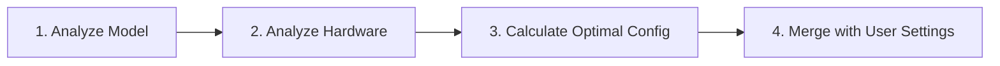

# Auto-Optimizer Guide

Automatic configuration optimization for optimal training performance.

## Table of Contents
- [Overview](#overview)
- [How It Works](#how-it-works)
- [Configuration](#configuration)
- [Optimization Modes](#optimization-modes)
- [What Gets Optimized](#what-gets-optimized)
- [User Requirements](#user-requirements)
- [Examples](#examples)
- [Advanced Usage](#advanced-usage)
- [Limitations](#limitations)

## Overview

The Auto-Optimizer automatically calculates optimal training configurations based on:
- **Model**: Architecture, size, parameters
- **Hardware**: GPU type, memory, count
- **User Dataset Params**: Sequence length, packing settings

**Benefits**:
- ✅ No need to manually tune batch sizes
- ✅ Optimal parallelism strategies (FSDP, tensor parallel)
- ✅ Memory-efficient settings
- ✅ Hardware-specific optimizations
- ✅ Prevents common mistakes (OOM, slow training)

**When to use**:
- Starting with a new model
- Trying new hardware
- Not sure about optimal settings
- Want to maximize efficiency

**When NOT to use**:
- You have proven optimal settings
- Replicating specific research configs
- Need exact control over all parameters

---

## How It Works

### 3-Step Process



**Step 1: Model Analysis**
- Detects model architecture (Llama, Mistral, etc.)
- Counts parameters (7B, 70B, etc.)
- Identifies MoE models
- Determines layer structure for FSDP

**Step 2: Hardware Analysis**
- Detects GPU type (H100, A100, V100, etc.)
- Measures GPU memory
- Checks compute capability
- Identifies supported features (Flash Attention, bf16, etc.)

**Step 3: Optimization**
- Calculates max safe batch size
- Selects parallelism strategy
- Chooses optimizer
- Configures memory optimizations

**Step 4: User Override**
- Your explicit settings always win
- Auto-config fills in the gaps

---

## Configuration

### Basic Setup

```yaml
auto_config:
  enabled: true
  optimize_for: "balanced"  # speed, memory, quality, or balanced

  # YOU MUST PROVIDE (dataset-specific):
  sequence_length: 2048
  sample_packing: true
  pad_to_sequence_len: true
```

### With Custom Overrides

```yaml
auto_config:
  enabled: true
  optimize_for: "speed"
  sequence_length: 4096
  sample_packing: true

hyperparameters:
  # Auto-config will calculate these:
  # - micro_batch_size
  # - gradient_accumulation_steps
  # - optimizer
  # - fsdp settings

  # But you can override any:
  learning_rate: 1e-4  # Your value takes precedence
  lora_r: 64           # Your value takes precedence
```

---

## Optimization Modes

### balanced (RECOMMENDED)

**Best overall performance**

```yaml
auto_config:
  optimize_for: "balanced"
```

**Optimizes for**:
- Good training speed
- Reasonable memory usage
- Good convergence quality

**Settings**:
- Moderate batch sizes
- Gradient checkpointing for models >7B
- Fused optimizer
- Flash Attention (if supported)
- Conservative parallelism

**Best for**:
- Most use cases
- Production training
- When unsure

**Example output**:
```yaml
# 7B model on 4× A100 (80GB)
micro_batch_size: 4
gradient_accumulation_steps: 8
optimizer: "adamw_torch_fused"
flash_attention: true
bf16: true
gradient_checkpointing: true
fsdp: false  # Not needed for 7B
```

### speed

**Maximum throughput**

```yaml
auto_config:
  optimize_for: "speed"
```

**Optimizes for**:
- Fastest training time
- Maximum GPU utilization
- High throughput

**Settings**:
- Maximum batch sizes (push GPU to limit)
- Minimal gradient accumulation
- Fastest optimizer
- No gradient checkpointing
- Aggressive parallelism

**Trade-offs**:
- ⚠️ Higher memory usage
- ⚠️ May sacrifice some quality
- ⚠️ Higher risk of OOM

**Best for**:
- Time-critical projects
- Lots of GPUs available
- Model fits comfortably in memory

**Example output**:
```yaml
# 7B model on 4× A100 (80GB)
micro_batch_size: 8  # Pushed to limit
gradient_accumulation_steps: 2  # Minimal
optimizer: "adamw_torch_fused"  # Fastest
flash_attention: true
bf16: true
gradient_checkpointing: false  # Disabled for speed
```

### memory

**Minimum memory usage**

```yaml
auto_config:
  optimize_for: "memory"
```

**Optimizes for**:
- Smallest memory footprint
- Ability to train larger models
- Stability (no OOM)

**Settings**:
- Minimum batch sizes (1)
- Maximum gradient accumulation
- 8-bit optimizer
- Gradient checkpointing always on
- CPU offloading for very large models

**Trade-offs**:
- ⚠️ Slower training
- ⚠️ More gradient accumulation steps
- ⚠️ May use CPU/disk (very slow)

**Best for**:
- Limited GPU memory
- Training 70B+ models on consumer GPUs
- Budget constraints
- Avoiding OOM errors

**Example output**:
```yaml
# 70B model on 4× A100 (80GB)
micro_batch_size: 1  # Minimum
gradient_accumulation_steps: 64  # Compensate
optimizer: "paged_adamw_8bit"  # Memory-efficient
flash_attention: true
bf16: true
gradient_checkpointing: true
fsdp: true
fsdp_config:
  fsdp_offload_params: true  # CPU offloading
  fsdp_cpu_ram_efficient_loading: true
```

### quality

**Best convergence**

```yaml
auto_config:
  optimize_for: "quality"
```

**Optimizes for**:
- Best model quality
- Stable training
- Good convergence

**Settings**:
- Moderate batch sizes (not too large)
- Conservative gradient accumulation
- Full-precision optimizer
- Gradient checkpointing for larger batches
- Minimal parallelism (avoids quality degradation)

**Trade-offs**:
- ⚠️ Slower than speed mode
- ⚠️ More memory than necessary

**Best for**:
- Research
- Critical applications
- When quality matters most
- Small-scale training

**Example output**:
```yaml
# 7B model on 4× A100 (80GB)
micro_batch_size: 2  # Conservative
gradient_accumulation_steps: 16
optimizer: "adamw_torch_fused"  # Full precision
flash_attention: true
bf16: true
gradient_checkpointing: true
warmup_ratio: 0.1  # Longer warmup
weight_decay: 0.01  # Regularization
```

---

## What Gets Optimized

### Automatically Calculated

| Parameter | How It's Calculated |
|-----------|-------------------|
| `micro_batch_size` | Based on GPU memory, model size, sequence length |
| `gradient_accumulation_steps` | To reach target effective batch size |
| `optimizer` | Based on mode and training type |
| `flash_attention` | If GPU supports (Ampere+) |
| `bf16` | If GPU supports (Ampere+) |
| `tf32` | If GPU supports (Ampere+) |
| `gradient_checkpointing` | If model >7B or memory mode |
| `fsdp` | If model >13B |
| `fsdp_config.*` | Based on model architecture |
| `tensor_parallel_size` | If model >70B and many GPUs |
| `context_parallel_size` | If sequence_length >8192 |

### Never Changed (User Control)

These are NEVER overridden by auto-config:
- `learning_rate`
- `num_epochs`
- `lora_r`, `lora_alpha`, `lora_dropout`
- `lr_scheduler`
- `warmup_ratio`
- `weight_decay`
- `val_set_size`
- `evals_per_epoch`
- `saves_per_epoch`

### Overridable

You can override any auto-config value:
```yaml
auto_config:
  enabled: true
  optimize_for: "balanced"

hyperparameters:
  micro_batch_size: 1  # Override auto-config
  flash_attention: false  # Override auto-config
```

---

## User Requirements

### Must Provide

You **MUST** provide these (dataset-specific):

```yaml
auto_config:
  enabled: true
  sequence_length: 2048      # REQUIRED
  sample_packing: true       # REQUIRED
  pad_to_sequence_len: true  # Optional but recommended
```

**Why required?**
- `sequence_length`: Critical for memory calculation
- `sample_packing`: Affects memory and speed

**How to find sequence_length**:
```python
# Analyze your dataset
from datasets import load_dataset
ds = load_dataset("json", data_files="data.jsonl")

# Get max length
max_len = max(len(sample['text'].split()) for sample in ds)
# Add 20% buffer, round to power of 2
sequence_length = next_power_of_2(max_len * 1.2)
```

### Optional Hints

```yaml
auto_config:
  enabled: true
  optimize_for: "balanced"
  sequence_length: 2048
  sample_packing: true

  # Optional hints:
  target_batch_size: 128      # Target effective batch
  prefer_quality: true         # Bias toward quality
  aggressive_memory: false     # Conservative memory usage
```

---

## Examples

### Example 1: 7B Model, Single Node

```yaml
job_id: "llama-7b-auto"
model: "meta-llama/Llama-3.1-7B"
training_type: "qlora"
nodes: 1
gpus_per_node: 4

auto_config:
  enabled: true
  optimize_for: "balanced"
  sequence_length: 2048
  sample_packing: true

# Auto-config will set:
# micro_batch_size: 4
# gradient_accumulation_steps: 8
# optimizer: "adamw_torch_fused"
# flash_attention: true
# bf16: true
# gradient_checkpointing: true
# fsdp: false
```

### Example 2: 70B Model, Multi-Node

```yaml
job_id: "llama-70b-auto"
model: "meta-llama/Llama-3.1-70B"
training_type: "qlora"
nodes: 8
gpus_per_node: 8

auto_config:
  enabled: true
  optimize_for: "memory"  # Large model
  sequence_length: 4096
  sample_packing: true

# Auto-config will set:
# micro_batch_size: 1
# gradient_accumulation_steps: 32
# optimizer: "paged_adamw_8bit"
# flash_attention: true
# bf16: true
# gradient_checkpointing: true
# fsdp: true
# fsdp_config:
#   fsdp_offload_params: true
#   fsdp_transformer_layer_cls_to_wrap: "LlamaDecoderLayer"
# tensor_parallel_size: 2
```

### Example 3: Custom Overrides

```yaml
job_id: "custom-auto"
model: "mistralai/Mistral-7B-v0.3"
training_type: "lora"
nodes: 1
gpus_per_node: 2

auto_config:
  enabled: true
  optimize_for: "speed"
  sequence_length: 2048
  sample_packing: true

hyperparameters:
  # Override auto-config:
  micro_batch_size: 2  # Force smaller batch
  learning_rate: 1e-4  # Custom LR
  lora_r: 64           # Custom LoRA rank

  # Auto-config will still set:
  # gradient_accumulation_steps (calculated)
  # optimizer
  # flash_attention
  # etc.
```

---

## Advanced Usage

### Disable for Specific Parameters

```yaml
auto_config:
  enabled: true
  optimize_for: "balanced"
  sequence_length: 2048
  sample_packing: true

  # Disable specific auto-optimizations:
  disable:
    - fsdp           # Don't use FSDP even if beneficial
    - flash_attention # Don't use Flash Attention
```

### Model Metadata Override

If auto-detection fails:

```yaml
auto_config:
  enabled: true
  optimize_for: "balanced"
  sequence_length: 2048
  sample_packing: true

  # Provide model metadata manually:
  model_metadata:
    num_parameters: 7_000_000_000
    num_layers: 32
    hidden_size: 4096
    num_attention_heads: 32
    model_type: "llama"
```

### Hardware Override

```yaml
auto_config:
  enabled: true
  optimize_for: "balanced"
  sequence_length: 2048
  sample_packing: true

  # Override hardware detection:
  hardware_override:
    gpu_type: "A100"
    gpu_memory_gb: 80
    supports_bf16: true
    supports_flash_attn: true
```

---

## Limitations

### What Auto-Config Cannot Do

1. **Task-specific tuning**: Doesn't know your task (QA vs summarization)
2. **Dataset quality**: Can't assess dataset quality
3. **Domain knowledge**: Can't incorporate domain expertise
4. **Learning rate**: Never sets learning rate (too task-specific)
5. **LoRA parameters**: Doesn't tune LoRA rank (task-dependent)

### When to Use Manual Config

Use manual configuration when:
- ✅ Replicating research results
- ✅ You have proven optimal settings
- ✅ Need exact reproducibility
- ✅ Very specific requirements
- ✅ Auto-config fails for your setup

### Known Issues

1. **MoE models**: Detection works but may not be optimal
2. **Custom architectures**: May fall back to conservative defaults
3. **Mixed GPU types**: Uses capabilities of weakest GPU
4. **Very long sequences (>32k)**: May be overly conservative

---

## Debugging Auto-Config

### View Generated Config

```bash
# See what auto-config generated
python integration/train_wrapper.py \
  --job-config my_job.yaml \
  --validate-only \
  --show-auto-config
```

### Logs

Auto-config logs its decisions:
```
INFO: Starting auto-configuration (optimize_for=balanced)
INFO: Model analyzed: 7.2B params, type=llama, MoE=False
INFO: Hardware detected: A100 (80GB), 4 GPUs total, Flash Attn: True
INFO: Calculated micro_batch_size=4 (model=14.4GB, available=65.6GB, seq_len=2048)
INFO: Configuration Summary:
INFO:   micro_batch_size: 4
INFO:   gradient_accumulation_steps: 8
INFO:   effective_batch_size: 128
INFO:   optimizer: adamw_torch_fused
INFO:   fsdp: False
```

### Validation

```python
# Check if settings make sense
effective_batch = micro_batch_size × gradient_accumulation_steps × num_gpus

# Should be 64-256 for most models
assert 64 <= effective_batch <= 256, "Unusual batch size"
```

---

## Next Steps

- **[Hyperparameters Guide](HYPERPARAMETERS.md)** - Manual tuning
- **[Performance Tuning](PERFORMANCE.md)** - Advanced optimization
- **[Job Configuration](JOB_CONFIG.md)** - Complete config reference
- **[Examples](EXAMPLES.md)** - Real-world configurations
